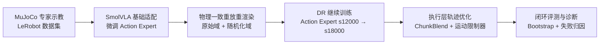

# SmolVLA：UR10e 语言条件机器人操作的 MuJoCo 仿真闭环

> 面向 UR10e 抓取放置任务，搭建从专家数据、SmolVLA 动作专家微调，到域随机化训练、执行层轨迹优化和闭环评测诊断的 VLA 工程链路。所有结果均来自固定实验矩阵，不外推为真实机械臂性能。

## 核心贡献与结果

| 核心工作 | 针对的问题 | 关键方法 | 结果 |
| --- | --- | --- | --- |
| **环境级域随机化训练** | 单一环境数据对纹理、颜色和光照变化覆盖有限 | 确定性专家轨迹重放重渲染，原始域与随机化域均衡采样，从 s12000 继续微调 Action Expert | 完成 **576 次**视觉鲁棒性 rollout；原始外观成功率 **92.2%**，未见颜色宏平均 **60.4% / 59.9%**（默认 / 未见光照） |
| **执行层轨迹优化** | 相邻 Action Chunk 独立生成，边界处可能出现关节目标跳变和运动方向突变 | **K=4 ChunkBlend + p99×1.1 关节运动限制器** | 末端 Jerk P95 **下降 29.9%**，Chunk 边界跳变 P95 **下降 36.8%** |
| **评测与诊断** | 单点成功率无法表达场景不确定性，人工回看难以规模化定位失败 | 双随机种子、严格成功判定、Scene 聚类 Bootstrap、自动失败阶段分类 | 120 组配对 rollout，联合控制组严格成功率 **96.67%**，95% CI **[93.33%, 99.17%]** |

**技术栈**：Python · PyTorch 2.7 · HuggingFace LeRobot 0.4.4 · SmolVLA（Flow Matching 动作生成）· MuJoCo 3.6

**重点阅读**：[域随机化训练与效果](#环境级域随机化训练与视觉鲁棒性) · [执行层轨迹优化](#执行层轨迹优化) · [评测与诊断](#评测与诊断)

---

## 流水线总览



---

## 基础链路：数据采集与模型适配

### 专家数据采集

- 在 MuJoCo 中构建 UR10e + Robotiq 2F85 仿真环境，配置第三视角与腕部两路 256×256 RGB 相机；物体布局由 `scene_seed` 确定并可复现。
- 以 20 Hz 键盘遥操作采集数据，通过 IK 将末端增量转换为 7 维绝对关节目标动作（6 关节角 + 1 夹爪指令）。
- 采集 40 条专家轨迹，覆盖 20 个共享场景与 `mug_on_blue`、`mug_on_yellow` 两类语言任务，并写入 LeRobot v3 数据集。


> 四条专家 episode 的第三视角同步回放，覆盖不同场景布局和两类语言目标；按轨迹进度对齐，以 2 倍速播放。

### SmolVLA 基础适配

- 从 `lerobot/smolvla_base` 初始化，保留预训练视觉语言表征，**仅微调动作专家（Action Expert）**。
- 输入两路图像、7 维当前状态和英文指令，输出 50 步、7 维绝对关节目标的 Action Chunk。
- 在 RTX 4090 上训练至 s12000（batch 8，FP16 AMP），完整保存模型配置、权重及策略前后处理器。

---

## 环境级域随机化训练与视觉鲁棒性

### 物理一致的随机化数据生成

逐帧图像增强难以保证双相机、时间序列和物理状态一致。本项目利用 `scene_seed` 与专家绝对关节目标动作确定性重放已验证轨迹，仅改变环境纹理与光照后重新渲染，在不重复遥操作的情况下生成随机化示范。


> 每组左右画面对应同一源 episode、同一帧索引和同一动作序列；随机化只改变纹理与光照，标签中的最大状态偏差来自重放校验。

### 数据配方与继续微调

- 构建 **40 条原始域轨迹 + 40 条随机化域轨迹，共 80 条、18,984 帧**。
- 对原始域与随机化域进行均衡采样：原始域数据回放用于维持已有任务能力，随机化域数据提供视觉变化监督。
- 从 s12000 checkpoint 继续微调 Action Expert 6,000 步，得到有效训练步数为 s18000 的 DR 模型。

### DR-s18000 视觉鲁棒性表现

在 16 个未见场景上，按 2 个任务、2 个 `policy_seed` 和 9 种外观/光照条件完成 **576 次闭环 rollout**。灰、紫、橙三种颜色及 `new_light` 均未参与训练。


> 柱高为严格成功率，误差线为 Scene 聚类 Bootstrap 95% CI。

| 视觉条件 | 默认光照 | 未见光照 `new_light` |
| --- | ---: | ---: |
| 原始外观 | **92.2%** | **92.2%** |
| 未见灰色 | 45.3% | 37.5% |
| 未见紫色 | 75.0% | 78.1% |
| 未见橙色 | 60.9% | 64.1% |
| 三种未见颜色宏平均 | **60.4%** | **59.9%** |

训练域组合 `changed@alt` 的成功率为 **79.7%**。原始外观对本次光照变化表现稳定，未见颜色呈现部分泛化，灰色仍是主要弱项。

> 该矩阵是 DR-s18000 checkpoint 的描述性评测。由于缺少相同协议下的未做 DR 模型对照，不将上述结果表述为域随机化带来的因果提升，也不外推到复杂材质或 Sim2Real。

---

## 执行层轨迹优化

SmolVLA 每次生成 50 步 Action Chunk，执行前 25 步后重新预测（execution horizon = 25）。相邻动作块由两次独立推理产生，边界处可能出现关节目标跳变或运动方向突变。本项目在不修改模型权重的情况下组合两项执行层处理。

### 关节运动限制器

使用专家轨迹关节速度与加速度的 p99×1.1 裕量进行标定，将策略输出转换为满足 `velocity_limits` 和 `acceleration_limits` 的渐进参考轨迹。限制器分别约束期望速度与加速度，并在积分参考点越过目标时精确停靠；夹爪指令保持透传。

### ChunkBlend 动作块边界融合

以旧 Chunk 尾帧为锚点，对新 Chunk 前 K 帧进行线性融合，使新动作块从上一动作块终点平滑过渡。关节角插值前回卷到 `[-π, π)`，避免跨 π 绕行；离散夹爪指令不参与插值。

### 联合控制效果

使用相同 s12000 checkpoint、代码版本、20 个未见场景、2 个任务和 3 个 `policy_seed` 进行 120 组配对对照。基线关闭限制器并设置 K=0；联合控制组启用 **K=4 ChunkBlend + p99×1.1 关节运动限制器**。


> 四组对照覆盖两类任务，基线与联合控制均成功，并按控制步同步、以 2 倍速播放。每组标题给出该轨迹的 Jerk 与 Chunk 边界跳变降幅。

| 指标（120 条 rollout 的逐轨迹中位数） | 基线 | 联合控制 | 变化 |
| --- | ---: | ---: | ---: |
| 末端 Jerk P95（m/s³） | 42.76 | **29.98** | **下降 29.9%** |
| Chunk 边界跳变 P95（rad） | 0.02262 | **0.01430** | **下降 36.8%** |
| 边界方向翻转率中位数 | 9.55% | **0** | **中位数降至 0** |

联合控制主要改善轨迹连续性。成功率为 95.0%（114/120）→ 96.67%（116/120），Scene 配对 Bootstrap 差值 95% CI 为 **[0, 4.17] 个百分点**，区间包含 0，因此不宣称成功率显著提升；成功轨迹步数也基本不变。方向翻转率为 0 是逐轨迹中位数，不表示每条轨迹的全部边界均无反转。

---

## 评测与诊断

### 闭环评测协议

- **双随机性显式建模**：`scene_seed` 控制场景布局，`policy_seed` 控制 Flow Matching 的 Action Chunk 采样噪声。
- **严格成功判定**：目标物进入目标区内缩边界、保持直立稳定 0.5 秒，并且夹爪已释放。
- **闭环执行**：20 Hz 控制，每次预测 50 步、执行 25 步后重规划，每条最多 360 步。
- **可恢复评测**：按 `scene|task|prompt|policy` 稳定实验键即时落盘，并通过 SHA-256 校验支持断点续跑。

### Scene 聚类 Bootstrap

同一 `scene_seed` 下的多个任务与策略种子共享布局随机性，不能被视为完全独立样本。评测以场景为聚类单元进行 10,000 次有放回重采样，同一场景内的全部 rollout 整体进出，再由重采样分布的 2.5% 和 97.5% 分位数构造置信区间。

| 维度 | 配置 |
| --- | --- |
| 评测规模 | 20 个未见场景 × 2 个任务 × 3 个 `policy_seed` = **120 条 rollout** |
| 联合控制组严格成功率 | **96.67%（116/120）** |
| Scene 聚类 Bootstrap 95% CI | **[93.33%, 99.17%]** |
| 重采样设置 | B=10,000，聚类单元=`scene_seed` |

### 自动失败阶段分类

评测器根据状态与事件记录自动输出失败类型，减少逐条人工回看视频的成本。

| 分类 | 含义 |
| --- | --- |
| `grasp_failure` | 未抓住目标或抓取后脱落 |
| `transport_failure` | 搬运过程中目标脱离夹爪 |
| `place_failure` | 放置偏移或未满足稳定条件 |
| `timeout` | 达到最大步数仍未完成 |
| `control_exception` | 仿真或控制有效性异常，不计为策略失败 |

评测结束后同步输出逐条归因、任务/场景交叉分布以及 S1–S5 阶段到达率，形成“发现失败→定位阶段→补采或调参→重新验证”的策略迭代闭环。

---

## 快速复现

```powershell
# 1. 进入本机评测环境
conda activate smolvla-eval

# 2. 联合控制组：120 条多种子闭环评测
.\evaluate\run.ps1 `
  --checkpoint outputs\train\smolvla_ur10e_mug_v1_b8_s12000\checkpoints\last\pretrained_model `
  --config configs\eval\mug_v1_s12000_unseen_multiseed_k4_limiter.yaml `
  --chunk-blend 4 `
  --output-dir outputs\eval\s12000_unseen_multiseed_k4_limiter

# 3. DR-s18000：576 条颜色 OOD 与光照鲁棒性评测
python -m evaluate.diagnose_mug_visual_robustness `
  --checkpoint outputs\train\smolvla_ur10e_mug_v1_dr_b8_s18000 `
  --config configs\eval\mug_robustness\diagnose_mug_color_ood_dr.yaml `
  --output-dir outputs\eval\robustness\mug_color_ood_dr_s18000

# 4. 从现有数据集与评测结果重建 README 素材
python -m scripts.build_readme_media
```

联合控制基线使用 `configs\eval\mug_v1_s12000_unseen_multiseed_baseline.yaml`，并关闭 ChunkBlend。完整 DR 设计与结论边界见[域随机化训练思路与实验设计](域随机化训练思路与实验设计.md)。

---

## 项目结构

| 目录 | 职责 |
| --- | --- |
| `sim/` | UR10e MuJoCo 仿真环境、严格成功判定与失败分类 |
| `collector/` | 键盘遥操作、LeRobot v3 数据写入与质量检查 |
| `cloud/` | 云端训练入口、环境预检与 smoke test |
| `evaluate/` | 闭环 rollout、Bootstrap 统计、阶段检测与诊断工具 |
| `configs/` | 训练、评测、运动限制和视觉鲁棒性配置 |
| `scripts/` | 跨种子分析、实验对比与 README 素材生成 |
| `assets/` | MuJoCo 模型资源、README 可视化素材与第三方许可证 |
| `tests/` | 场景、采集、评测与诊断测试 |
