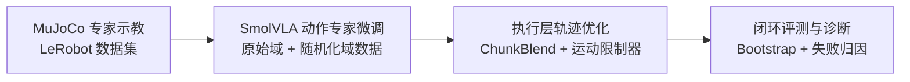
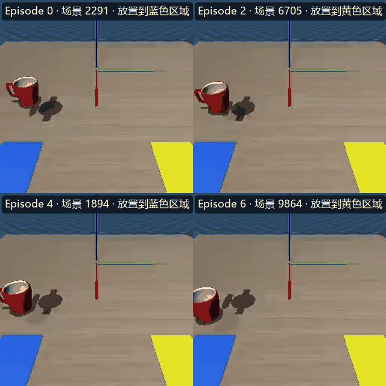
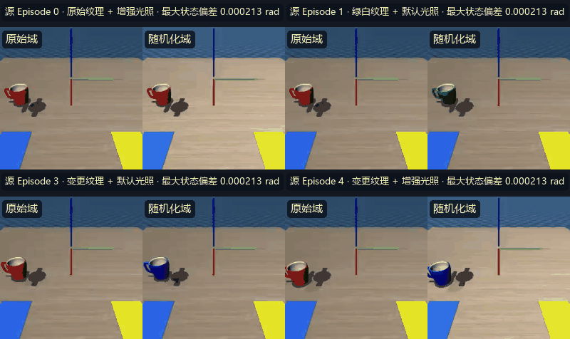
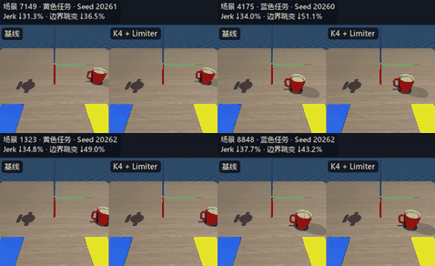
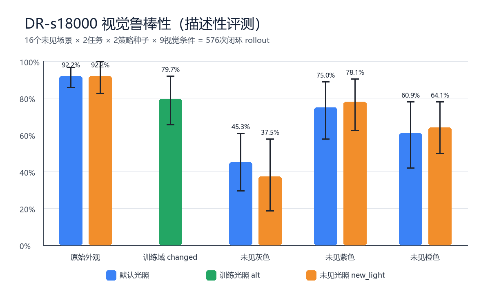

# SmolVLA：UR10e 语言条件机器人操作的 MuJoCo 仿真闭环

>  **VLA（Vision-Language-Action）模型工程化闭环** ：从仿真环境与数据采集，到云端微调 SmolVLA 动作专家，再到执行层轨迹优化与统计严谨的闭环评测。所有结论均来自固定实验矩阵上的定量指标。

## 核心指标速览

| 指标 | 数值 |
| --- | --- |
| 未见场景严格成功率 | **96.67%**（20 未见场景 × 2 任务 × 3 policy seed = 120 条 rollout） |
| 成功率 95% 置信区间（Scene 分层 Bootstrap，B=10000） | **[93.33%, 99.17%]** |
| 执行层优化：末端 Jerk P95 | **42.76 → 29.98 m/s³（↓ 29.9%）** |
| 执行层优化：Chunk 边界跳变 P95 | **0.02262 → 0.01430 rad（↓ 36.8%）** |
| 执行层优化：边界方向翻转率 | **9.55% → 0** |
| DR 模型：原始外观成功率 | **92.2%**（默认光照与未见光照均为 59/64） |
| DR 模型：未见颜色宏平均成功率 | **60.4% / 59.9%**（默认光照 / 未见光照） |

**技术栈**：Python · PyTorch 2.7 · HuggingFace LeRobot 0.4.4 · SmolVLA（Flow Matching 动作生成）· MuJoCo 3.6

---

## 流水线总览



本文按这 4 个阶段展开，其中 **执行层轨迹优化** 与 **评测与诊断** 是本项目的核心亮点。

---

## 阶段一：数据采集（Data Collection）

**解决的问题**：VLA 策略的质量上限由数据决定，而「评测能不能信」由数据契约与成功口径决定。

- 在 MuJoCo 中构建 UR10e + Robotiq 2F85 仿真环境：第三视角 + 腕部两路 RGB 相机（256×256），物体布局由 `scene_seed` 完全可复现；
- 20 Hz 键盘遥操作采集（IK 末端增量控制 → 7 维绝对关节目标动作），动作/观测契约固定：6 关节角 + 1 夹爪指令；
- **严格成功判定**：目标物中心进入目标区内缩边界、保持直立稳定 0.5 秒、夹爪已释放——口径先于评测定义，杜绝「宽松判定刷成功率」；
- 产出 LeRobot v3 格式数据集（40 条 mug 专家数据：20 共享场景 × 2 任务 `mug_on_blue` / `mug_on_yellow`），元数据完整记录 scene seed 与初始位姿。



> 四条专家 episode 的第三视角同步回放，覆盖不同场景布局以及蓝色、黄色两类语言目标；按轨迹进度对齐，以 2 倍速播放。

---

## 阶段二：模型训练（Training）

**解决的问题**：让预训练 VLA 适配 UR10e 的具体操作技能，而不是从零训练大模型。

- 从 HuggingFace `lerobot/smolvla_base` 初始化，保留预训练视觉语言表征，**仅微调动作专家（Action Expert）**；
- 输入：两路 256×256 图像 + 7 维当前状态 + 英文指令；输出：7 维绝对关节目标动作（50 步 Action Chunk）；
- 在 RTX 4090 上将主任务模型训练至 s12000（batch 8，FP16 AMP），checkpoint 完整保存模型配置、权重与策略前后处理器。

### 2.1 环境级域随机化训练

逐帧像素增强难以保证双相机与时间序列的一致性。本项目利用 `scene_seed` 和绝对关节目标动作确定性重放已验证的专家轨迹，仅改变纹理与光照后重新渲染，在不重新遥操作的情况下生成物理一致的随机化示范。



> 每组左右画面对应同一源 episode、同一帧索引和同一动作序列；随机化只改变纹理与光照，标签中的最大状态偏差来自重放校验。

- 保留 **40 条原始域轨迹 + 40 条随机化域轨迹，共 80 条、18,984 帧**；
- 训练时对原始域与随机化域数据进行均衡采样：原始域数据回放用于维持已有任务能力，随机化域数据提供视觉变化监督；
- 从 s12000 checkpoint 继续训练动作专家 6000 步，得到有效训练步数为 s18000 的 DR 模型。

```bash
bash scripts/train.sh \
  --config configs/train/mug_dr_s12000.yaml \
  --dataset-root smolvla-data/smolvla_ur10e_mug_dr
```

---

## 阶段三：执行层轨迹优化（Deployment Optimization）⭐

**核心问题**：SmolVLA 每次生成一个 Action Chunk，执行前 25 步后重新预测。相邻动作块由两次独立推理产生，边界处可能出现关节目标跳变或运动方向突变。本项目在不修改模型权重的情况下组合两项执行层处理。

### 3.1 关节运动限制器

策略输出的绝对关节目标可能使相邻控制步变化超出专家示教分布。限制器使用专家轨迹的关节速度与加速度 p99 再乘 1.1 裕量进行标定，将单步目标转换为满足 `velocity_limits` / `acceleration_limits` 的渐进参考轨迹：分别约束期望速度和加速度，再积分出本步参考位置；并做**跨目标检测**——积分参考点越过模型目标时精确停靠，避免振荡。第 7 维夹爪指令原样透传。

### 3.2 ChunkBlend 动作块边界融合

重预测时以**旧 chunk 尾帧为锚点**（即边界时刻实际到达的目标），对新 chunk 前 K 帧做线性插值，让新 chunk 从旧 chunk 的终点出发。两个关键保护：

- **角度回卷**：关节角是循环量，插值前把角度差回卷到 `[-π, π)`，避免跨 π 时多转一整圈（如 +3.0 与 -3.0 直插绕远路）；
- **夹爪透传**：第 7 维是离散开/合语义，不参与插值，避免产生「半开半合」的无效中间夹持力。

### 3.3 联合控制效果

对照采用同一 s12000 checkpoint、同一代码版本及相同的 20 个未见场景 × 2 个任务 × 3 个 `policy_seed`。基线关闭限制器并设置 K=0；联合控制组启用 **K=4 ChunkBlend + p99×1.1 关节运动限制器**。



> 四组对照覆盖蓝色、黄色两类任务，基线与联合控制均成功，并按控制步同步、以 2 倍速播放。每组标题给出该轨迹的 Jerk 与 Chunk 边界跳变降幅。

| 指标（逐轨迹中位数） | 基线 | 联合控制 | 变化 |
| --- | ---: | ---: | ---: |
| 末端 Jerk P95（m/s³） | 42.76 | **29.98** | **↓ 29.9%** |
| Chunk 边界跳变 P95（rad） | 0.02262 | **0.01430** | **↓ 36.8%** |
| 边界方向翻转率 | 9.55% | **0** | **消除方向反转** |

联合控制将高频末端运动与动作块边界突变同时压低。成功率为 95.0%（114/120）→ 96.67%（116/120），Scene 配对 Bootstrap 的差值 95% CI 为 **[0, 4.17] 个百分点**，成功轨迹步数中位数为 255.5 → 252，P90 为 307.4 → 308。

---

## 阶段四：评测与诊断（Evaluation & Diagnosis）⭐

### 4.1 闭环评测协议

- **双随机性显式建模**：`scene_seed` 控制物体布局随机性，`policy_seed` 控制 Flow Matching 的 Action Chunk 采样噪声；
- 20 Hz 闭环执行：每次预测 50 步、只执行前 25 步后重规划（execution horizon），每条最多 360 步；
- **严格成功口径**：目标物进入内缩边界 + 直立稳定 0.5 秒 + 夹爪已释放；
- 断点续跑：结果按稳定实验键（`scene|task|prompt|policy`）即时落盘，支持 SHA-256 校验的 `--resume`。

### 4.2 Scene-level Bootstrap

**问题陈述**：单点成功率无法表达场景差异带来的不确定性。评测矩阵中同一场景下有多条轨迹（多个 `policy_seed`），它们**共享同一布局随机性**——若把同场景下的轨迹当作独立样本直接算区间，会犯 **Pseudo-replication（假重复）** 统计错误，区间会被显著低估、高估显著性。

**解决方案**：以 `scene_seed` 为**聚类单元**做有放回重采样（B=10000）：每次从 20 个场景中整组抽取场景，**同一场景内的全部轨迹（含全部 policy_seed）整体进出**，重算成功率；最终置信区间取重采样分布的分位数——即 **Percentile Method（分位数法）**。

| 维度 | 配置 |
| --- | --- |
| 评测规模 | 20 个未见场景 × 2 个任务 × 3 个 policy_seed = **120 条 rollout** |
| 联合控制组严格成功率 | **96.67%（116/120）** |
| 95% 置信区间（Scene 分层 cluster Bootstrap） | **[93.33%, 99.17%]** |
| 重采样 | B=10000，聚类单元 = scene_seed |

### 4.3 自动化阶段失败分类器

**解决的问题**：评测 120 条 rollout 后，人工逐条回看视频归因不可扩展。评测器内置**自动化失败分类器**，结束后直接产出失败归因分布，无需人工回看视频：

| 分类维度 | 含义 |
| --- | --- |
| `grasp_failure` | 抓取失败（未抓住 / 抓取后脱落） |
| `transport_failure` | 搬运掉落（运输途中目标脱离夹爪） |
| `place_failure` | 放置偏移 / 未稳定（未达内缩边界或未满足稳定条件） |
| `timeout` | 超时（达到步数上限仍未完成） |
| `control_exception` | 控制异常（仿真/控制有效性异常，不计为策略失败） |

评测结束即输出逐条归因、按任务/场景交叉分布与阶段进展统计（S1–S5 各阶段到达率与失败阶段），支撑「先归因、后补采/调参」的迭代闭环。

### 4.4 DR-s18000 视觉鲁棒性表现

DR-s18000 使用 16 个未见场景 × 2 个任务 × 2 个 `policy_seed` × 9 个外观/光照条件，共完成 **576 次闭环 rollout**。灰、紫、橙三种纯色及 `new_light` 均未参与训练。



> 柱高为严格成功率，误差线为 Scene Bootstrap 95% CI；该图描述 DR-s18000 checkpoint 的表现，不构成相对未做 DR 模型的因果对照。

| 视觉条件 | 默认光照 | 未见光照 `new_light` |
| --- | ---: | ---: |
| 原始外观 | **92.2%** | **92.2%** |
| 未见灰色 | 45.3% | 37.5% |
| 未见紫色 | 75.0% | 78.1% |
| 未见橙色 | 60.9% | 64.1% |
| 三种未见颜色宏平均 | **60.4%** | **59.9%** |

训练域组合 `changed@alt` 的成功率为 **79.7%**。原始外观在默认与未见光照下均保持 92.2%，说明该 checkpoint 对本次光照变化表现稳定；未见颜色取得部分泛化，其中灰色仍是主要弱项。

> 本矩阵是 DR-s18000 checkpoint 的描述性评测，缺少相同协议下的未做 DR 模型对照，因此不将上述结果表述为域随机化带来的因果提升，也不外推到复杂材质或 Sim2Real。

---

## 快速复现

```powershell
# 1. 进入评测环境（本机 Windows + smolvla-eval Conda 环境）
conda activate smolvla-eval

# 2. 联合控制组：120 条多 seed 闭环评测
.\evaluate\run.ps1 `
  --checkpoint outputs\train\smolvla_ur10e_mug_v1_b8_s12000\checkpoints\last\pretrained_model `
  --config configs\eval\mug_v1_s12000_unseen_multiseed_k4_limiter.yaml `
  --chunk-blend 4 `
  --output-dir outputs\eval\s12000_unseen_multiseed_k4_limiter

# 3. DR-s18000：576 条颜色 OOD × 光照鲁棒性评测
python -m evaluate.diagnose_mug_visual_robustness `
  --checkpoint outputs\train\smolvla_ur10e_mug_v1_dr_b8_s18000 `
  --config configs\eval\mug_robustness\diagnose_mug_color_ood_dr.yaml `
  --output-dir outputs\eval\robustness\mug_color_ood_dr_s18000

# 4. 从现有数据集与评测结果重建 README 素材
python -m scripts.build_readme_media
```

联合控制的基线组使用 `configs\eval\mug_v1_s12000_unseen_multiseed_baseline.yaml`，并关闭 `--chunk-blend`。完整 DR 设计与结论边界见 `域随机化训练思路与实验设计.md`。

---

## 项目结构

| 目录 | 职责 |
| --- | --- |
| `sim/` | UR10e MuJoCo 仿真环境、严格成功判定与失败分类 |
| `collector/` | 键盘遥操作采集、LeRobot v3 数据集写入与质检 |
| `cloud/` | 云端训练入口、环境预检与 smoke test |
| `evaluate/` | 闭环 rollout、Bootstrap 统计、阶段检测与诊断工具 |
| `configs/` | 评测 / 训练 / 运动限制 / 鲁棒性配置 |
| `scripts/` | 跨 seed 聚合分析、云端入口脚本 |
| `assets/` | MuJoCo 模型资源、README 可视化素材与第三方许可证 |
| `tests/` | 场景、采集、评测与诊断的单元测试 |

---
